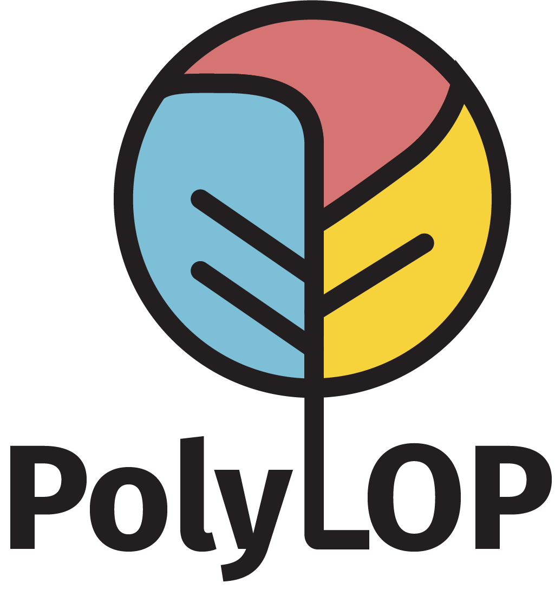

# PolyLOP (Polymer Lifecycle Optimization Program)

PolyLOP (**Poly**mer **L**ifecycle **O**ptimization **P**rogram) is an open-source Python-based tool designed to optimize process routes and quantities across the plastics production chain and end-of-life treatment to minimize system-wide impacts.

## Description

PolyLOP (Polymer Lifecycle Optimization Program) is an open-source Python-based tool designed to optimize process routes and quantities across the plastics production chain and end-of-life treatment to minimize system-wide impacts. It utilizes the Gurobi solver for linear optimization to assess the feasibility of a net-zero transition in the global plastic industry.

## Prerequisites

- Python 3.9.15
- Gurobi Optimizer
- Conda (for environment management)

## Installation

1. Clone this repository:
   ```
   git clone https://github.com/ecological-systems-design/polyLOP.git
   cd polyLOP
   ```

2. Create and activate the Conda environment:
   ```
   conda env create -f environment.yml
   conda activate guro
   ```

3. Install Gurobi:
   Follow the official Gurobi installation guide and obtain a license.

4. Obtain necessary data:
   Some data files are not included in the repository due to size or confidentiality. Ensure you have the necessary permissions and access to these datasets before running the program. Place them in the appropriate directories as described in the Project Structure section.

## Project Structure

```
polyLOP/
│
├── .idea/              (PyCharm project settings, not version-controlled)
├── data/
│   ├── external/
│   │   ├── ihs/        (license required, not version-controlled)
│   │   ├── iam/        (version-controlled)
│   │   ├── World_Countries_(Generalized)/  (version-controlled)
│   │   └── klotz_plastic_recycling.xlsx    (version-controlled)
│   ├── figure/         (not version-controlled)
│   ├── intermediate/   (not version-controlled)
│   ├── processed/      (not version-controlled)
│   └── raw/            (version-controlled)
├── figure/             (not version-controlled)
├── src/                (source code files, version-controlled including all subfolders)
├── .gitignore
├── environment.yml
├── LICENSE
├── main.py
└── README.md
```

Note: 
- The `data/external/ihs/` directory is intended for IHS Markit data that require additional license. 
- The `src/` directory and all its subfolders are version-controlled.

### .gitignore

The project uses a .gitignore file to exclude certain directories and files from version control. The main ignored paths are:

```
data/external/ihs/*
data/intermediate/*
data/processed/*
data/figure/*
figure/*
.idea/*
```

Make sure to maintain this .gitignore configuration to avoid accidentally committing sensitive or generated data.

## Usage

To run the main optimization program:

```
python main.py
```

This script processes the data, performs the optimization, and generates figures in the output directory.


## License

This project is licensed under the MIT License - see the [LICENSE](LICENSE) file for details.

## Contact

For any queries regarding PolyLOP, please open an issue in this repository or contact Jing Huo at [jhuo@ethz.ch].